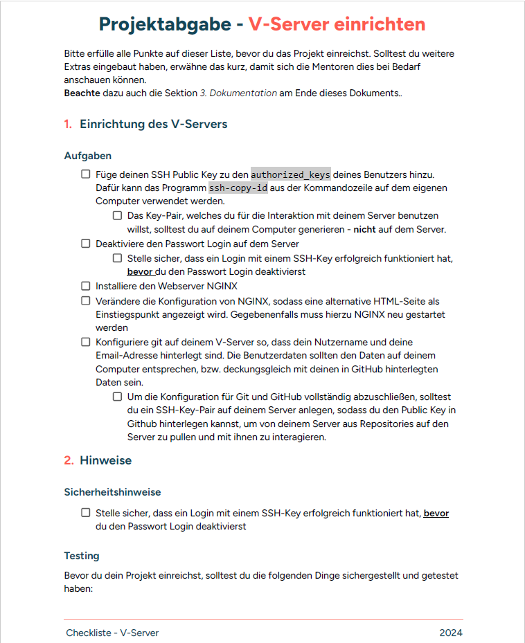
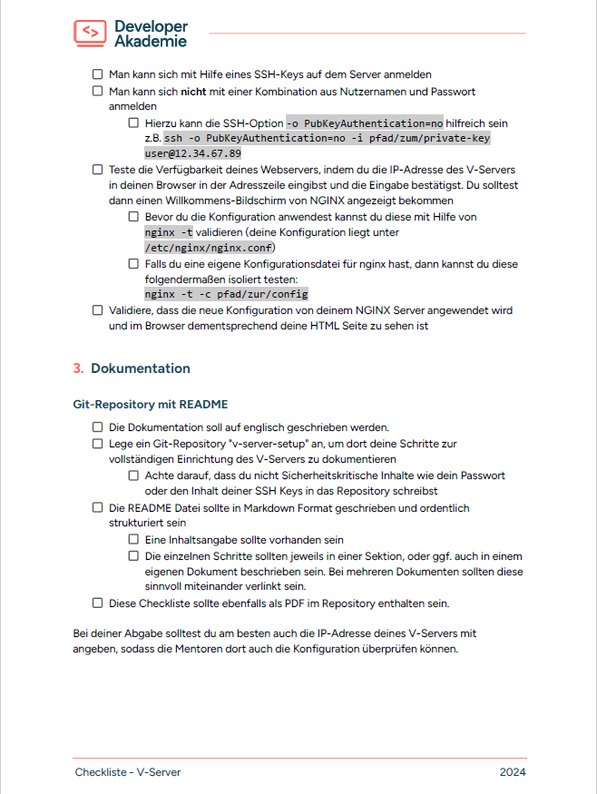

# HOW TO SET UP A VM  
sources:  
    * Developer Akademie (DevSecOps Masterclass)
    * ChatGPT for debugging and further definitions
    * Google Translate for translation

## Table of contents  
* <a href="#what-exactly-is-a-vm">What exactly is a VM?</a>  
* <a href="#what-exactly-is">The Login</a>  
    * <a href="#create-a-ssh-key-for-your-local-server">Create a SSH-Key for your local server</a>  
    * <a href="#store-the-ssh-key-on-your-vm">Store the SSH-Key on your VM</a>  
    * <a href="#deactivate-the-possibility-to-login-with-a-password">Deactivate the possibility to login with a password</a>  
    * <a href="#alias-the-ssh-connection">Alias the SSH connection</a>  
    * <a href="#ssh-config-for-several-identities">SSH config for several identities</a>  
* <a href="#the-web-server-nginx">The web server - Nginx</a>  
    * <a href="#install-and-activate-nginx">Install and activate Nginx</a>  
    * <a href="#configurate-nginx">Configurate Nginx</a>  
* <a href="#the-checklist">The Checklist</a>


## What exactly is a VM?  
Long story short - A **VM**, **Virtual Machine** or **Virtual Server** is a software program that runs on a 
bare-metal server and emulates it. A VM can run an operating system and applications as if they were running on real hardware.
A software environment called Hypervisor creates and manages the VMs.

## The Login

### Create a SSH-Key for your local server  
**SSH (Secure Shell)** is a protocol that allows secure access to a remote computer over an insecure network.
An **SSH-Key (Secure Shell Key)** is a cryptographic key pair used to authenticate SSH connections. SSH-Keys are more secure than password-based authentication because they use strong encryption. 
Once set up, you no longer have to enter a password to connect to the server. 
They are also well suited for automated processes and scripts that need to access remote servers in a secure manner. 
The SSH-Key pair consists of a private key and a public key.  
The **private key** should be kept secure and secret. It is saved on the client (your computer) and is used to authenticate to a server.  
The **public key** can be passed on without hesitation or stored on the server you want to log in to. 
It is used to encrypt messages that can only be decrypted with the corresponding private key.

#### Procedure  
1. Open the program **Git Bash** as admin.  
  
2. Create a ED25519 SSH-Key pair (more secure than RSA SSH-Key pair).  
```console
ssh-keygen -t ed25519  
--> choose to use a password or not
```

### Store the SSH-Key on your VM  
You can login to your VM without creating a SSH-Key. But then you always need the password and that is laborious and insecure (by the way).
Why? Basically every password can be bruteforced.  
> i: A brute force attack is a method in which an attacker systematically tries all possible combinations of passwords to find the right combination and gain unauthorized access to a system or account.  
  
That's why we want to store the SSH-Key on the VM so that we can login with it instead of a password.

#### Procedure  
1. Copy your public SSH-Key.  
```console
ssh-copy-id -i path/to/your/id_ed25519.pub user_vm@ip-address_vm
```
  
At best the public SSH-Key is now stored in `~/.ssh/authorized_keys` - or not...  
```console
ERROR: failed to open ID file: No such file or directory.
```
  
But why though? Honestly I don't know.  
> i: Note from the future: Maybe the problem were the wrong question marks. I prewrote the command in MSWord and ChatGPT told me, that they are graphic question marks then. So don't do that.  


#### What to do now?
1. Copy the public SSH-Key manually after displaying it:  
```console
cat ~/.ssh/id_ed25519.pub
```
  
2. Login to your VM.  
```console
ssh user_vm@ip-address_vm  
--> enter your password
```
  
3. Add the SSH-Key to the file *authorized_keys* and save it.  
```console
sudo nano ~/.ssh/authorized_keys
```
  
After you logged out from your VM with `logout` or `exit`, you can now login with `ssh user_vm@ip-address_vm` and without password.

### Deactivate the possebility to login with a password  
Now we want that NOBODY could login to our VM with a username-password-combination.
We have to deactivate the **PasswordAuthentication** option in the sshd config file.

#### Procedure  
1. Open the config file with an editor.  
```console
sudo nano /etc/ssh/sshd_config
```
  
2. Activate the option `PasswordAuthentication` and change it from `yes` to `no`.  
  
3. Restart the SSH service.  
```console
sudo systemctl restart ssh.service
```
  
4. How to proof that it worked out? We know that the login without password is activated and the SSH-Key connection is working. But we don't know if it is impossible to login with one. We can test ist with:  
```console
ssh -o PubkeyAuthentication=no user_vm@ip-address_vm
```
If you get the information `user_vm@ip-address_vm: Permission denied (pubkey)` then it worked out.  
> i: The command explicitly disables public key authentication and attempts to use password authentication instead. However, if the server is configured to only accept public keys, authentication will fail.

### Alias the SSH connection  
If you're thinking: `Oh no, the command to login to my VM is soooo hard to remember!`, than there are good news. The savior is called **shell alias**.  
A shell alias is an abbreviation or alternative name for a longer command or sequence of commands in the shell.
Aliases help commonly used commands run more efficiently and quickly by associating them with shorter or easier-to-remember names.

#### Procedure  
1. Have a look at the manual of the alias programm.  
```console
man alias
--> Dädum. If you're working with the **Git Bash** for Windows there is no `man-command`.
--> No problem, just go on with second.
```
  
2. Define the alias.  
```console
alias vm_connection="ssh user_vm@ip-address_vm"
```
  
3. Did it worked out?  
```console
alias | grep vm_connection
```
  
4. Logout from your VM with `logout` or `exit`.  
  
5. Login to your VM with your alias.  
```console
vm_connection
```
  
Yeah, it worked out! But what happens if you close the git bash and start a new session? `Command not found.` Wait, what, why???  
> i: By default, aliases are only available for the duration of the current shell session. To make them persistent, you need to define them in one of your shell configuration files.  
  
6. Open or create the **bash_profile** script that runs whenever you start a new shell session.  
```console
sudo nano ~/.bash_profile
```
  
7. Add the following if it's not already listed and save:  
```bash
if [ -f ~/.bashrc ]; then
        . ~/.bashrc
fi
```
  
8. Reload the file.  
```console
source ~/.bash_profile
```
  
9. Open or create the **bashrc** - the config file for the bash which is, thanks to the bash_profile script, executed every time a terminal is opened.  
```console
sudo nano ~/.bashrc
```
  
10. Add your alias to the document and save it.  
```console
alias vm_connection="ssh user_vm@ip-address_vm"
```
  
11. Reload the file.  
```console
source ~/.bashrc
```
  
12. Close the bash, open a new one and try your alias.  
Congrats! You can now login to your VM with a short and concise command.

### SSH config for several identities  
Are there any other ways to simplify establishing a connection to the VM? Yes, there are.  
On the local server there is a **SSH-Client** or -Agent installed that is executed every time a connection to a server is opened.
If there are more than one host or identity you can register them in the config file.

#### Procedure  
1. Open the SSH-Client config file or create one if there is none  - on the local server, not on the VM!  
```console
sudo nano ~/.ssh/config
```
  
2. Add the following information:  
```nginx
Host ip-address_vm
     User user_vm
     PreferredAuthentications publickey
     IdentityFile ~/.ssh/id_ed25519
```
  
3. Connect to the VM just with your IP-address.  
```console
ssh ip-address_vm
--> Very nice, you are logged in now.
```
  
4. Create an alias for that command in the **basrc** if you are too lazy to learn the IP-address by heart. No worries we all are...

## The web server - Nginx 
`Yesssss, I have a VM! Let's type the IP-address in the address bar of the browser and have a look what happens. Nothing?`  
The accessibility of the VM from the Internet depends heavily on the network configuration, particularly on how ports and services are configured.
There are some reasons why you can't open the VM in the web browser. However we need a web server to do so.


### Install and activate Nginx

#### Procedure  
1. Update the VM (you should do it regularly).  
```console
sudo apt update
```
  
2. Install Nginx.  
```console
sudo apt install nginx -y
```
> i: Why -y? Y stands for yes. The answer of the question the command line would ask you instead in the next step: Are you sure you want to install Nginx?  
  
3. Check the status of Nginx.  
```console
systemctl status nginx
--> Uhhh, it's already active!
```

### Configurate Nginx  
If we now browse our IP-address we are welcomed by the Nginx homepage. But we would like to be welcomed by our own homepage, don't we?

#### Procedure  
1. The default homepage is stored under `/var/www/html/index.nginx-debian.html`.  
To get our own homepage we create the folder *alternatives* under the path:  
```console
sudo mkdir /var/www/alternatives
```
  
2. And add an alternate index.html.  
```console
sudo mkdir /var/www/alternatives/alternate-index.html
```
  
Maybe it looks like this:  
```html
<!doctype html>
<html>
  <head>
	<meta charset="utf-8">
	<title>Hello, Nginx!</title>
  </head>

  <body>
	<h1>Hello, I am an alternative Homepage for Nginx</h1>
	<p>Noice to see ya :)</p>
	<p>You can meet me at IP-address: 116.203.104.65</p>
  </body>
</html>
```
3. Now we want the alternate index to be loaded by Nginx. Create a Nginx config file for this purpose.  
```console
sudo nano /etc/nginx/sites-enabled/alternatives
```
> i: By default there is only the default config file that loads the current homepage: /etc/nginx/sites-enabled/default  
  
4. Create a server- and a location-block    
```nginx
server {
	listen 8081;
	listen [::]: 8081;

	root /var/www/alternatives;
	index alternate-index.html

	location / {
		try_files $uri $uri/ =404;
	}
}
```
Wait what?  
> i: server block: Regulates that incoming HTTP-Requests to our IP-address are handled by the Nginx web server.  
  
> i: listen 8081: The web server now runs on IP-port 8081. The default port is 80 as you can see in the default config file.  
  
> i: root and index: Where is the root or where should Nginx look for the home page? The starting point for the web server should be the index alternate-index.html.  
  
> i: location block: Takes care of the paths that come after http://IP-address/.  
  
5. Restart Nginx to update the news.  
```console
sudo service nginx restart
```
  
Is the alternate homepage running on `http://ip-adress_vm`?  
Does the url: `http://ip-address_vm/abc` returns `404 Not Found`?  
Then everything is as it should be. Congrats!


Maybe you think `Cool, but I don't want to type every time :8081 as ending... Can I set the alternative index.html as an entry point? For example by forwarding the requests to the default port 80 to 8081?`  
Excellent question! Yes, you can!

#### Procedure  
1. Modify the default config file.  
```nginx
server {
        listen 80 default_server;
        listen [::]: 80 default_server;

        server_name _;

	#forwarding to port 8081 (alternatives)
        location / {
                proxy_pass http://localhoast:8081;
		proxy_set_header Host $host;
        	proxy_set_header X-Real-IP $remote_addr;
        	proxy_set_header X-Forwarded-For $proxy_add_x_forwarded_for;
        	proxy_set_header X-Forwarded-Proto $scheme;
        }
}
```
2. Test if it worked out.  
```console
sudo nginx -t
```
  
3. If the Test was successful, restart Nginx.  
```console
sudo service nginx restart
```
  
4. Open the IP-address of the VM in the browser. The alternative homepage should open. If yes, well done! If not, ask ChatGPT for help, bye!  
<a href="http://116.203.104.65/" target="_blank">Alternate Nginx Homepage</a>

## The Checklist  
  
  
  
  
<a href="https://github.com/SarahZimmermann-Schmutzler/v-server-setup/blob/main/checklist_filled_out.pdf" target="_blank">Checklist</a>
